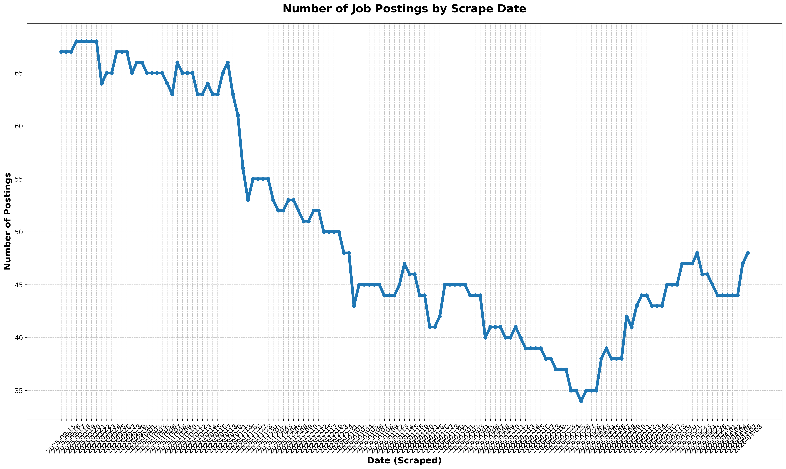

# 🚀 EOS Job Scraper

[](https://www.python.org/)
[](https://www.selenium.dev/)
[](https://www.sqlite.org/)
[](https://www.google.com/sheets/about/)

A robust, automated job scraper designed to track career opportunities at **EOS Energy Storage**. It monitors job listings, saves them to a local SQLite database, syncs new entries to a Google Sheet, and provides analytical insights into hiring trends.

---

## ✨ Features

- **Automated Scraping**: Uses Selenium with ChromeDriver to navigate and extract job data.
- **Deduplication**: Automatically filters out duplicate job listings using a unique link constraint in SQLite.
- **Cloud Sync**: Seamlessly appends new jobs to a Google Sheet for easy sharing and tracking.
- **Data Analysis**: Includes a built-in analysis engine to visualize hiring trends over time.
- **Flexible Configuration**: Easily adjustable paths and selectors.

---

## 📊 Insights & Trends

The script includes an analysis module that generates visualizations of job posting trends. Below is an example of the generated insights:



---

## 🛠️ Tech Stack

- **Language**: Python 3.x
- **Automation**: Selenium WebDriver
- **Storage**: SQLite3 (Local), Google Sheets API (Cloud)
- **Data Processing**: Pandas, NumPy
- **Visualization**: Matplotlib

---

## ⚙️ Prerequisites

- **Python 3.x**: Ensure you have Python installed.
- **Google Chrome**: The scraper is optimized for Chrome.
- **ChromeDriver**: Must match your Chrome version and OS.
- **Google Service Account**: Required for Google Sheets integration.
  - Place your `gspread_creds.json` in the configured credentials directory.

---

## 🚀 Installation & Setup

1. **Clone the Repository**:
   ```bash
   git clone https://github.com/sellamiam/EOSJobScraper.git
   cd EOSJobScraper
   ```

2. **Install Dependencies**:
   ```bash
   pip install -r requirements.txt
   ```

3. **Configure Paths**:
   Update the following constants in `eos_jobs_scraper.py`:
   - `GOOGLE_CREDS_FILE`: Path to your Google service account JSON.
   - `CHROMEDRIVER_PATH`: Path to your `chromedriver` executable.

---

## 📖 Usage

### 1. Run the Scraper
Execute the main script to scrape jobs and sync data:
```bash
python eos_jobs_scraper.py
```

### 2. Run the Analysis
Generate hiring trend visualizations:
```bash
python eos_jobs_analysis.py
```

---

## 📁 Project Structure

- `eos_jobs_scraper.py`: The core scraping and syncing logic.
- `eos_jobs_analysis.py`: Script for cleaning data and generating plots.
- `eos_jobs.db`: Local SQLite database (auto-generated).
- `eos_jobs.csv`: Data export for analysis.
- `requirements.txt`: Python package requirements.

---

## 🤝 Contributing

Contributions are welcome! If you have suggestions or find bugs, please:
1. Open an **Issue** to discuss changes.
2. Submit a **Pull Request** with your improvements.

---

## ⚖️ Disclaimer

*This project is for educational and personal use. Use at your own risk. The developer is not responsible for any misuse or breakage caused by changes in the target website.*
